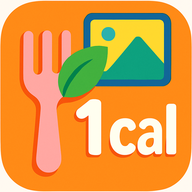

### Hi there 👋 I'm Salvador

   

I am a software engineer and have been working for the software industry for a while now, currently living nomadic; working full time as a Javascript / Python developer + DevOps.

Industries I have worked with: Tourism / AI / Social Media / Data Mining and Retail / E-Commerce.

You can connect with me @ linked-in [here](https://www.linkedin.com/in/salvadoraceves/)

## Where I Work

I work full-time at [**TourConnect AI**](https://www.tourconnect.ai/), building production AI software for travel operations.

My day-to-day scope includes:

- Backend APIs and integrations for itinerary and booking workflows.
- AWS infrastructure and Kubernetes operations for deployment, scaling, and reliability.
- Python and Node.js services for automation and data processing.
- Frontend product work when we need end-to-end delivery across the stack.

TourConnect AI is focused on AI software for DMCs and Tour Operators, including:

- [Itinerary Assist AI](https://www.tourconnect.ai/itinerary-assist) for itinerary quoting workflows.
- [Booking Automation AI](https://www.tourconnect.ai/booking-automation) for faster inbox-to-booking processing.
- [Closeouts Automation](https://www.tourconnect.ai/closeouts-automation) for closeout and stopsell workflows.

More about the company: [About TourConnect AI](https://www.tourconnect.ai/about-tour-connect-ai) and [Resources](https://www.tourconnect.ai/resources).

## Open Source Work

### TI2 (Tourism Information Interchange) 

[TI2](https://github.com/TourConnect/ti2) is an open source integration framework built for the tourism industry to standardize how systems exchange **bookings**, **content**, and **rates**.

Why TI2 is relevant for the industry:

- It reduces one-off point-to-point integrations by using shared standardized functions (for example: create, update, cancel).
- It uses a plugin architecture where integration plugins connect booking/content systems, and app plugins add value on top.
- It allows tourism businesses to connect faster across DMC, operator, OTA, and supplier ecosystems.
- It creates a reusable community layer where new system connectors can benefit multiple companies, not just one private integration.
- It is open source under GPL-3.0, encouraging collaboration and transparent evolution of integration standards.

Examples from the plugin ecosystem:

- [Tourplan plugin](https://github.com/TourConnect/ti2-tourplan)
- [Ventrata plugin](https://github.com/TourConnect/ti2-ventrata)
- And more connectors in the [TI2 plugin library](https://github.com/TourConnect/ti2#plugins).

## Personal Apps

### Visa Logger

<table>
  <tr>
    <td width="96" valign="top">
      
    </td>
    <td valign="top">
      <strong>Private visa planning assistant built with Flutter.</strong> 
      Tracks country limits, visit timelines, and remaining allowance while keeping data local and encrypted.
        
      
    </td>
  </tr>
</table>

- **Visa rules engine:** Configure max days per visit, rolling-window allowance, and period-replenish behavior per country.
- **Visit tracking:** Log entry/exit dates, planned trips, and inclusive day counting aligned with visa compliance.
- **Views:** Default travel log, calendar timeline, and day-by-day rolling breakdown validation.
- **Trip intelligence:** `planned`, `active`, and `completed` states with remaining-day indicators and limit warnings.
- **Data privacy:** Encrypted local storage for sensitive travel history.
- **Backups:** Folder-based backup/restore with timestamped ZIP files and automatic daily/weekly retention pruning.

### Lazy Calorie Counter

<table>
  <tr>
    <td width="96" valign="top">
      
    </td>
    <td valign="top">
      <strong>Automatic food detection + macro tracking from your photo library.</strong> 
      Android app that first classifies images on-device (offline) to detect food vs non-food, then analyzes food items for full nutrition insights.
        
      <strong>Why "Lazy"?</strong> You do not need to open the app or take pictures inside the app to start counting; it reads your existing gallery photos automatically.
        
      
    </td>
  </tr>
</table>

- Automatically scans your gallery and uses on-device ML to classify food/non-food without internet.
- In automatic mode, only food candidates are sent for AI analysis, returning calories plus macros (protein, carbs, fat).
- Integrates with Health Connect to read activity calories burned and keep nutrition/weight data in sync.
- Dynamically adjusts daily calorie budget based on activity imported from Health Connect.
- Includes weight gain/loss projection views based on intake trends and daily energy balance.

### SplitScreenTranslate

<table>
  <tr>
    <td width="96" valign="top">
      
    </td>
    <td valign="top">
      <strong>Live speech transcription and translation with a dual-pane view.</strong> 
      Android app for real-time listening, translated output, and configurable speech/translation engines.
        
      
    </td>
  </tr>
</table>

- Captures live speech and displays source + translated streams in split panes.
- Supports on-device translation mode and higher-quality cloud translation mode.
- Includes downloadable speech models, language selection, and speaker diarization options.
- Runs with background service support for ongoing live translation sessions.

### TokenGate

**Status:** Under construction.

TokenGate is a multi-tenant SaaS platform for managing LLM provider keys, prompt endpoints, immutable prompt versions, and token metering.

- Provides API key auth, prompt runtime execution, and quota enforcement.
- Uses envelope encryption for provider keys and secure key-hash storage for API credentials.
