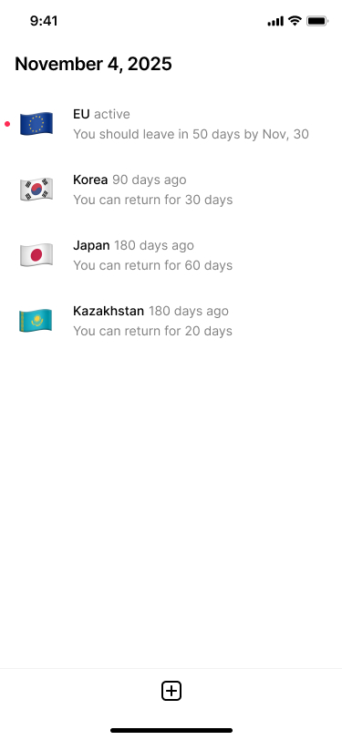

### Hi there 👋 I'm Salvador

   

I am a software engineer and have been working for the software industry for a while now, currently living nomadic; working full time as a Javascript / Python developer + DevOps.

Industries I have worked with: Tourism / AI / Social Media / Data Mining and Retail / E-Commerce.

You can connect with me @ linked-in [here](https://www.linkedin.com/in/salvadoraceves/)

## Personal Apps

### Visa Logger

Visa Logger is a Flutter app I built to track visa limitations and visit logs while traveling, with an offline-first approach.

- Tracks country visits with entry/exit records and inclusive day counting.
- Calculates remaining allowance for per-visit and rolling-window visa limits.
- Stores data locally with encrypted storage.
- Supports local backup and restore using timestamped ZIP snapshots.
- Install invite (Firebase App Distribution): [Get Visa Logger](https://appdistribution.firebase.dev/i/fe9cbaa36337b1a2)

