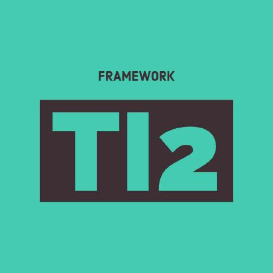

### Hi there 👋 I'm Salvador

   

I am a software engineer and have been working for the software industry for a while now, currently living nomadic; working full time as a Javascript / Python developer + DevOps.

Industries I have worked with: Tourism / AI / Social Media / Data Mining and Retail / E-Commerce.

You can connect with me @ linked-in [here](https://www.linkedin.com/in/salvadoraceves/)

## Professional Life

I am a software engineer focused on building production AI software for travel operations.

At [**TourConnect AI**](https://www.tourconnect.ai/), I currently work on AI copilots for itineraries and bookings, helping travel teams automate busywork and deliver customization at scale.

TourConnect AI is focused on AI software for DMCs and Tour Operators, including:

- [Itinerary Assist AI](https://www.tourconnect.ai/itinerary-assist) for itinerary quoting workflows.
- [Booking Automation AI](https://www.tourconnect.ai/booking-automation) for faster inbox-to-booking processing.
- [Closeouts Automation](https://www.tourconnect.ai/closeouts-automation) for closeout and stopsell workflows.

More about the company: [About TourConnect AI](https://www.tourconnect.ai/about-tour-connect-ai) and [Resources](https://www.tourconnect.ai/resources).

## Open Source Work

### TI2 (Tourism Information Interchange) 

[TI2](https://github.com/TourConnect/ti2) is an open source integration framework built for the tourism industry to standardize how systems exchange **bookings**, **content**, and **rates**.

Why TI2 is relevant for the industry:

- It reduces one-off point-to-point integrations by using shared standardized functions (for example: create, update, cancel).
- It uses a plugin architecture where integration plugins connect booking/content systems, and app plugins add value on top.
- It allows tourism businesses to connect faster across DMC, operator, OTA, and supplier ecosystems.
- It creates a reusable community layer where new system connectors can benefit multiple companies, not just one private integration.
- It is open source under GPL-3.0, encouraging collaboration and transparent evolution of integration standards.

Examples from the plugin ecosystem:

- [Tourplan plugin](https://github.com/TourConnect/ti2-tourplan)
- [Ventrata plugin](https://github.com/TourConnect/ti2-ventrata)
- And more connectors in the [TI2 plugin library](https://github.com/TourConnect/ti2#plugins).

## Personal Apps

### Visa Logger

<table>
  <tr>
    <td width="96" valign="top">
      
    </td>
    <td valign="top">
      <strong>Private visa planning assistant built with Flutter.</strong> 
      Tracks country limits, visit timelines, and remaining allowance while keeping data local and encrypted.
        
      
    </td>
  </tr>
</table>

- **Visa rules engine:** Configure max days per visit, rolling-window allowance, and period-replenish behavior per country.
- **Visit tracking:** Log entry/exit dates, planned trips, and inclusive day counting aligned with visa compliance.
- **Views:** Default travel log, calendar timeline, and day-by-day rolling breakdown validation.
- **Trip intelligence:** `planned`, `active`, and `completed` states with remaining-day indicators and limit warnings.
- **Data privacy:** Encrypted local storage for sensitive travel history.
- **Backups:** Folder-based backup/restore with timestamped ZIP files and automatic daily/weekly retention pruning.
