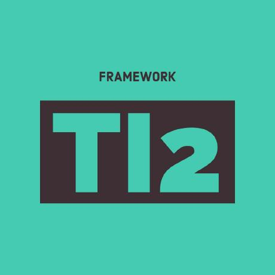
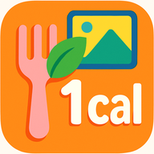

# Hi, I'm Salvador 👋

Software engineer · JavaScript / Python · DevOps · living nomadic 🌎

     

I have been working in the software industry for a while now, across Tourism, AI, Social Media, Data Mining, Retail, and E-Commerce.

## 💼 TourConnect AI

Full-time at [**TourConnect AI**](https://www.tourconnect.ai/) (Australia / US), building production AI software for DMCs and tour operators.

<table>
  <tr>
    <td width="55%" valign="top">
      <b>What I do</b>  
      · Backend APIs for itinerary &amp; booking workflows 
      · AWS + Kubernetes deployment, scaling, reliability 
      · Python / Node.js automation and data processing 
      · End-to-end frontend delivery when needed
    </td>
    <td valign="top">
      <b>Products</b>  
      <a href="https://www.tourconnect.ai/itinerary-assist">Itinerary Assist AI</a> — quoting workflows 
      <a href="https://www.tourconnect.ai/booking-automation">Booking Automation AI</a> — inbox to booking 
      <a href="https://www.tourconnect.ai/closeouts-automation">Closeouts Automation</a> — stopsell handling
    </td>
  </tr>
</table>

More about the company: [About TourConnect AI](https://www.tourconnect.ai/about-tour-connect-ai) and [Resources](https://www.tourconnect.ai/resources).

### 🌍 Open source — TI2 

[**Tourism Information Interchange**](https://github.com/TourConnect/ti2) — an open framework (GPL-3.0) developed under the TourConnect umbrella, standardizing how tourism systems exchange **bookings**, **content**, and **rates**.

- Replaces one-off point-to-point integrations with shared standardized functions (create, update, cancel).
- Plugin architecture: integration plugins connect booking/content systems, app plugins add value on top.
- Creates a reusable community layer where new connectors benefit multiple companies at once.

Connectors: [Tourplan](https://github.com/TourConnect/ti2-tourplan) · [Ventrata](https://github.com/TourConnect/ti2-ventrata) · [plugin library](https://github.com/TourConnect/ti2#plugins)

## 🚀 SaaS Apps

<table>
  <tr>
    <td width="96" align="center" valign="middle">
      
    </td>
    <td valign="middle">
      <b><a href="https://tokengate.aceves.mx/">TokenGate</a></b>&nbsp;&nbsp; 
      LLM keys, versioned prompts, and quotas in one place — published as API endpoints, managed from a web dashboard or a permission-scoped remote MCP endpoint. 
      <a href="https://tokengate.aceves.mx/">tokengate.aceves.mx</a>
    </td>
  </tr>
</table>

- Store OpenAI, Anthropic, Gemini, Hugging Face, and OpenRouter keys in an envelope-encrypted organization vault.
- Publish immutable prompt versions as text or image endpoints with project-scoped runtime keys.
- Track requests, token usage, and estimated model cost by client and model, with monthly quota enforcement.
- Add end-user authorization and Google Play Integrity checks without storing prompt payloads.

## 📱 Personal Apps

<table>
  <tr>
    <td align="center" width="50%" valign="top">
         
      <b><a href="https://panoribbon.aceves.mx/">PanoRibbon</a></b>&nbsp;&nbsp; 
      One wide photo → seamless carousel or pan video, all on-device  
    </td>
    <td align="center" width="50%" valign="top">
         
      <b><a href="https://latest.aceves.mx/">Latest</a></b>&nbsp;&nbsp; 
      Podcast player that keeps only the newest episode of every show  
    </td>
  </tr>
  <tr>
    <td align="center" width="50%" valign="top">
         
      <b><a href="https://visa.aceves.mx/">Visa Logger</a></b>&nbsp;&nbsp; 
      Private visa planner &amp; identity wallet — nothing leaves your device  
    </td>
    <td align="center" width="50%" valign="top">
         
      <b>Lazy Calorie Counter</b>&nbsp;&nbsp; 
      Macro tracking straight from your photo library, no manual logging  
    </td>
  </tr>
  <tr>
    <td align="center" colspan="2">
         
      <b>SplitScreenTranslate</b>&nbsp;&nbsp; 
      Live speech transcription + translation in a dual-pane view  
    </td>
  </tr>
</table>

<b>More detail on each app</b>

**🎞️ PanoRibbon** — creates 2 to 10 connected portrait slides and silent MP4 videos entirely on your phone.

- Reframe each carousel slide independently without breaking the continuous image.
- Preview the complete carousel before saving or sharing it.
- Keep photos private with on-device image and video processing, no account, and no tracking.

**🎧 Latest** — rebuilds a single newest-first queue whenever feeds refresh, so there is no backlog to manage.

- Find shows through Apple Podcasts search or subscribe with a direct RSS feed.
- Download the newest unplayed episodes for offline listening and keep playback positions on the device.
- Play in the background with lock-screen controls, chapter-aware skipping, playback speed controls, and automatic queue handoff.
- Send playback to Google Cast devices and resume on the phone from the same position.

**🛂 Visa Logger** — tracks country limits, visit timelines, remaining allowance, and travel documents without sending app records to a developer-run server.

- **Visa rules engine:** Configure max days per visit, rolling-window allowance, and period-replenish behavior per country.
- **Visit tracking:** Log entry/exit dates, planned trips, and inclusive day counting aligned with visa compliance.
- **Views:** Default travel log, calendar timeline, and day-by-day rolling breakdown validation.
- **Identity wallet:** Store passports, resident cards, and visas with dates, photographs, scans, and supporting files.
- **Data privacy:** Structured records are encrypted locally; attached files stay in the app's private storage.
- **Backups:** Timestamped ZIPs of travel records and documents, with automatic daily/weekly retention pruning.

**🍽️ Lazy Calorie Counter** — Android app that classifies images on-device (offline) to detect food vs non-food, then analyzes food items for full nutrition insights. You do not need to open the app or take pictures inside it; it reads your existing gallery photos automatically.

- Automatically scans your gallery and uses on-device ML to classify food/non-food without internet.
- In automatic mode, only food candidates are sent for AI analysis, returning calories plus macros.
- Integrates with Health Connect to read activity calories burned and keep nutrition/weight data in sync.
- Dynamically adjusts daily calorie budget based on activity, with weight gain/loss projection views.

**🗣️ SplitScreenTranslate** — Android app for real-time listening, translated output, and configurable speech/translation engines.

- Captures live speech and displays source + translated streams in split panes.
- Supports on-device translation mode and higher-quality cloud translation mode.
- Includes downloadable speech models, language selection, and speaker diarization options.
- Runs with background service support for ongoing live translation sessions.

## 🎸 Music

Outside of engineering, I play guitar and record ideas/tracks on SoundCloud.

[My Song 8](https://soundcloud.com/salvadoraceves/my-song-8-1) · [My Song 5](https://soundcloud.com/salvadoraceves/my-song-5) · [Tart Heart](https://soundcloud.com/salvadoraceves/tart-heart-2-wav) · [full profile](https://soundcloud.com/salvadoraceves)
